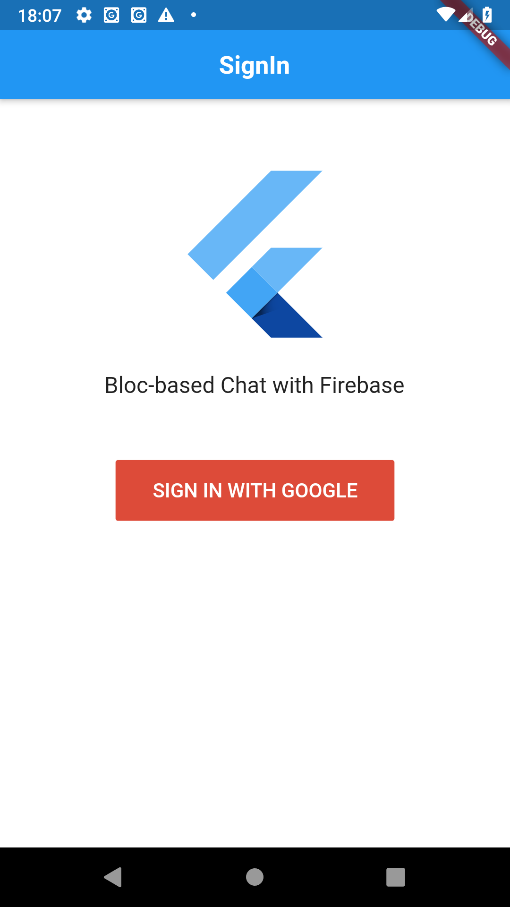
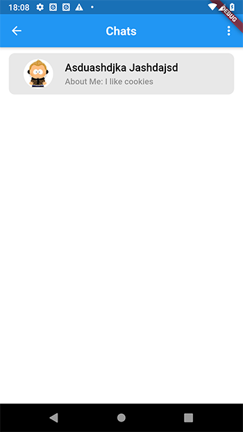
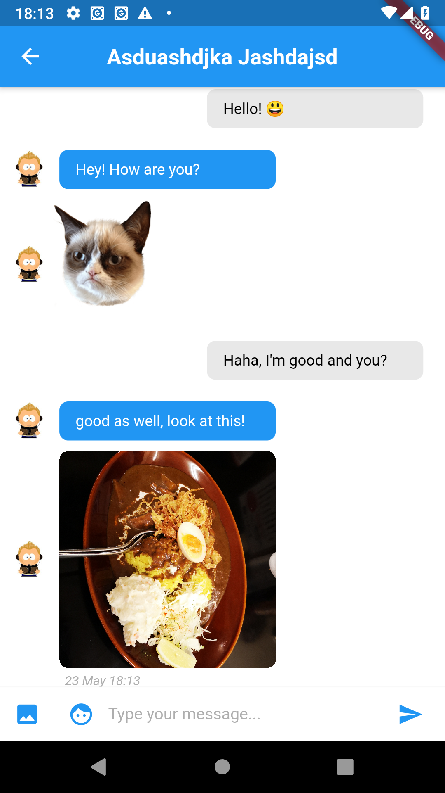
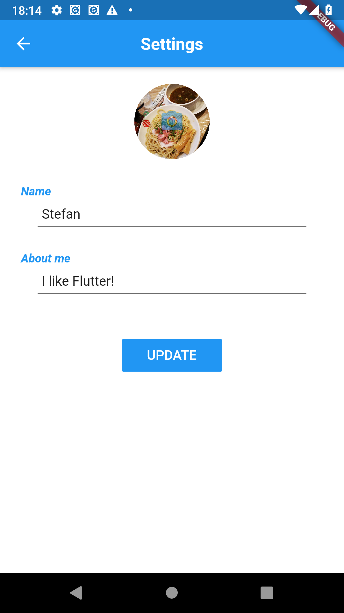

# Flutter-Bloc-Firebase-Chat Example
This project is based on the following two articles below. Afterwards I almost completely refactored it by adding bloc pattern, GetIt Library and other code optimizations. I did this project to learn Flutter and for better understanding of its state management.

https://medium.com/flutter-community/building-a-chat-app-with-flutter-and-firebase-from-scratch-9eaa7f41782e
https://medium.com/flutterpub/when-firebase-meets-bloc-pattern-fb5c405597e0

# Screenshots
   
